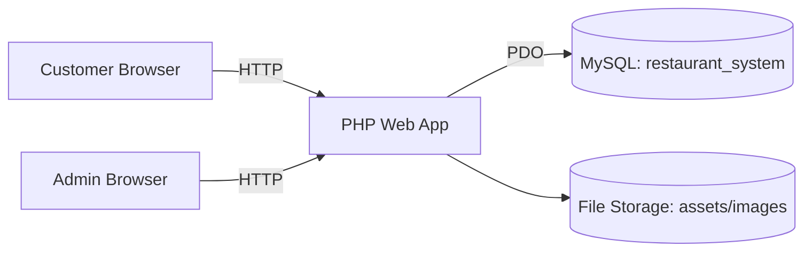
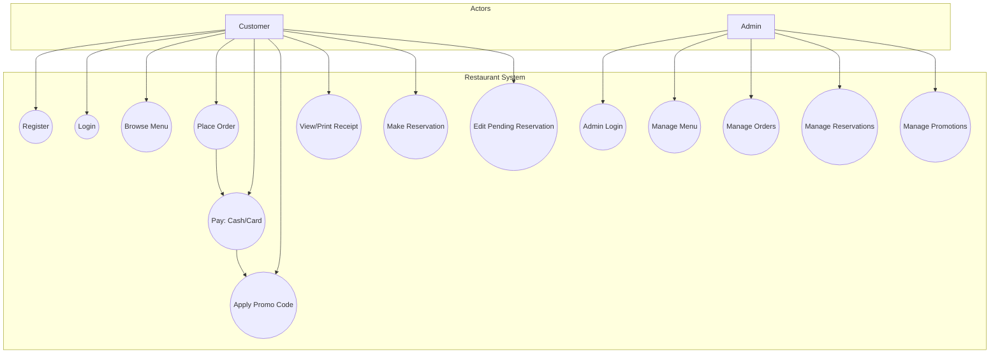
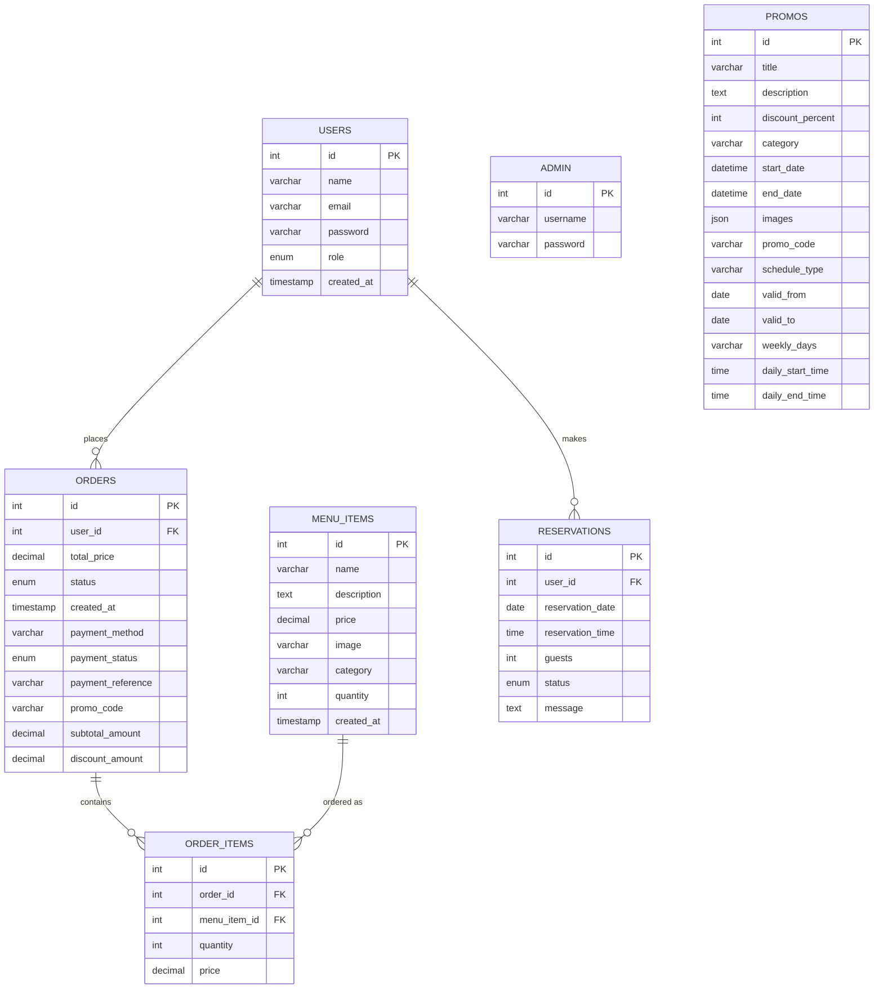
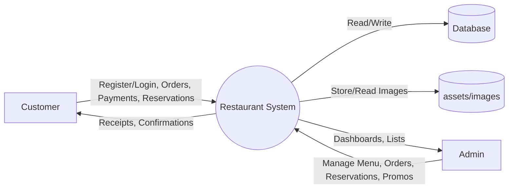
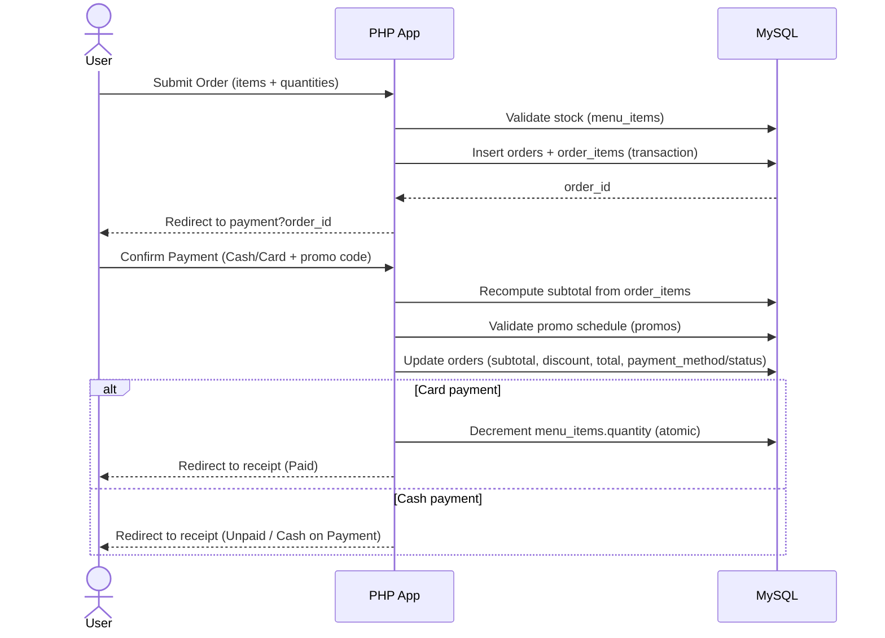

# Software Requirements Specification (SRS)
## Restaurant System (Restaroma)

**Project type**: Web application (PHP + MySQL)  
**Primary users**: Customer (User), Administrator (Admin)  
**Repository**: `Restaurant-System` (WAMP/XAMPP style local deployment)

---

## 1. Introduction

### 1.1 Purpose
This SRS defines the functional and non-functional requirements for the Restaurant System (“Restaroma”). The system supports online browsing of the menu, placing orders, payments (cash or card), applying promotional discounts, table reservations, and administrative management of menu items, orders, reservations, and promotions.

### 1.2 Scope
The system provides:
- Customer-facing features: account registration/login, menu browsing, ordering, payments, receipts, reservations, reservation edits.
- Admin features: secure login, dashboard, menu management, order management, reservation management, promotion management (including promo codes and schedules).

### 1.3 Definitions, Acronyms
- **SRS**: Software Requirements Specification  
- **DFD**: Data Flow Diagram  
- **ERD**: Entity Relationship Diagram  
- **Promo**: Promotion/discount (may be time-range or weekly schedule)  
- **COD**: Cash on delivery/payment (represented as Cash method with Unpaid status until paid physically)

### 1.4 References (Codebase Evidence)
Key modules observed in the project:
- Customer: `user/menu.php`, `user/order.php`, `user/payment.php`, `user/order_receipt.php`, `user/reservation.php`, `user/edit_reservation.php`, `user/udashboard.php`
- Admin: `admin/adashboard.php`, `admin/manage_menu.php`, `admin/manage_orders.php`, `admin/manage_reservations.php`, `admin/manage_promos.php`
- Security/session helpers: `includes/auth.php`
- Database schema: `restaurant_system.sql`

---

## 2. Overall Description

### 2.1 Product Perspective
The Restaurant System is a server-rendered web application:
- UI served via PHP pages (HTML/CSS/JS).
- Business logic embedded in PHP pages.
- Persistent storage in MySQL database `restaurant_system`.

### 2.2 Product Functions (High-level)
- User registration and authentication
- Menu browsing with category filtering
- Order placement with multiple items and quantities
- Payment flow (Cash or Card) and optional promo code
- Receipt generation and printing
- Reservation request and admin approval/cancellation
- Admin CRUD for menu items and promos
- Admin updates for order status and payment status

### 2.3 User Classes and Characteristics
- **Customer (User)**:
  - Browses menu
  - Registers/logs in
  - Creates orders, pays by cash/card, views receipts
  - Creates and edits pending reservations
- **Administrator (Admin)**:
  - Logs in through separate admin login
  - Manages menu inventory
  - Manages orders (status and payment status)
  - Manages reservations (approve/cancel)
  - Manages promos and promo codes

### 2.4 Operating Environment
- Server: PHP 8.x, MySQL 8.x (WAMP64 / localhost)
- Client: modern web browser (Chrome/Edge/Firefox)

### 2.5 Design and Implementation Constraints
- Server-side language: PHP (PDO used for DB operations)
- Database: MySQL schema defined in `restaurant_system.sql`
- Sessions used for authentication
- CSRF token used for POST requests

### 2.6 Assumptions and Dependencies
- Application is hosted at a base path similar to `/Restaurant-System/`.
- Database connection details are configured in `config/db.php`.
- Images for menu items and promos are stored in `assets/images/`.

---

## 3. System Features (Functional Requirements)

### 3.1 Authentication & Authorization

#### 3.1.1 User Registration
- **Description**: New customers can create an account using name, email, and password.
- **Inputs**: Name, Email, Password, Confirm Password
- **Outputs**: Account created; redirect to login with success message
- **Rules**:
  - Email must be valid and unique.
  - Password length must be at least 6.
  - Password and confirm password must match.
- **FR-REG-01**: The system shall allow a user to register with name, email, and password.
- **FR-REG-02**: The system shall prevent registration using an already-registered email.

#### 3.1.2 User Login/Logout
- **Description**: Users log in with email + password; sessions store identity.
- **FR-AUTH-01**: The system shall authenticate users using secure password verification.
- **FR-AUTH-02**: The system shall maintain user sessions after successful login.
- **FR-AUTH-03**: The system shall allow users to log out and destroy session data.

#### 3.1.3 Admin Login/Logout
- **Description**: Admins log in via a separate login page with a separate table (`admin`).
- **FR-ADMIN-01**: The system shall authenticate admins using username and password.
- **FR-ADMIN-02**: The system shall restrict admin pages to authenticated admins only.

---

### 3.2 Menu Browsing (Customer)
- **Description**: Customers can view menu items and filter by category.
- **FR-MENU-01**: The system shall display menu items with name, description, price, image (optional), and category.
- **FR-MENU-02**: The system shall allow users to filter displayed items by category.

---

### 3.3 Order Placement (Customer)
- **Description**: Logged-in users select items and quantities and submit an order.
- **Rules**:
  - User must select at least one item.
  - Quantity must be \(1..50\) and not exceed available stock for that item.
  - Order is created as `Pending` with `payment_method='Cash'` and `payment_status='Unpaid'` initially, then forwarded to payment page.
- **FR-ORD-01**: The system shall allow users to select multiple menu items per order.
- **FR-ORD-02**: The system shall validate requested quantities against current inventory.
- **FR-ORD-03**: The system shall create an order and order items transactionally.

---

### 3.4 Payment & Promotions (Customer)
- **Description**: User confirms payment method (Cash or Card). A promo code may be applied if active.
- **Rules**:
  - Valid payment methods: Cash, Card
  - For Card:
    - Validate card number (16 digits), expiry (MM/YY, not expired), CVV (3 digits), cardholder name (non-empty).
    - Mark payment as `Paid` upon confirmation.
    - Decrement inventory quantities for ordered menu items.
  - For Cash:
    - Save pricing breakdown (subtotal, discount, total) and keep `payment_status='Unpaid'` (cash to be paid later).
  - Promo:
    - Promo code lookup by `promos.promo_code`
    - Must be active “right now” based on promo schedule:
      - Date/time range schedule OR weekly-day schedule with time windows
    - Discount computed as percent of subtotal and applied to final total.
- **FR-PAY-01**: The system shall allow the user to choose Cash or Card payment.
- **FR-PAY-02**: The system shall support applying a promo code and computing discount percent.
- **FR-PAY-03**: The system shall update the order’s totals (subtotal, discount, final total) at payment confirmation time.
- **FR-PAY-04**: For Card payments, the system shall decrement inventory quantities atomically with order payment update.

---

### 3.5 Receipt (Customer)
- **Description**: User can view an order receipt with items, totals, promo, and payment/status info; receipt is printable.
- **FR-REC-01**: The system shall display receipt details for a user’s own order only.
- **FR-REC-02**: The system shall show subtotal, discount (if any), and final total.

---

### 3.6 Reservations (Customer)
- **Description**: User submits a reservation request; admin later approves/cancels. User can edit only pending reservations.
- **Rules**:
  - Date is required; cannot be earlier than today.
  - Time is required.
  - Guests must be \(1..10\).
  - Optional message up to 300 characters.
  - No duplicates for same user at the same date and time.
- **FR-RES-01**: The system shall allow a logged-in user to create a reservation request.
- **FR-RES-02**: The system shall prevent duplicate reservations for the same user/date/time.
- **FR-RES-03**: The system shall allow users to edit reservations only when status is Pending.

---

### 3.7 Admin Dashboard
- **Description**: Admin sees counts of core entities.
- **FR-AD-01**: The system shall display counts of menu items, orders, reservations, and promos.

---

### 3.8 Manage Menu (Admin)
- **Description**: Admin can add/update/delete menu items including image and inventory quantity.
- **Rules**:
  - Categories limited to: Main Course, Fast Food, Salads, Dessert, Drink
  - Image upload validation: type and max size (2MB)
- **FR-AM-01**: The system shall allow admin to create menu items.
- **FR-AM-02**: The system shall allow admin to update menu items (including optional image replacement).
- **FR-AM-03**: The system shall allow admin to delete menu items.

---

### 3.9 Manage Orders (Admin)
- **Description**: Admin can view all orders with items and update order status and payment status.
- **FR-AO-01**: The system shall display orders with user identity and item breakdown.
- **FR-AO-02**: The system shall allow admin to change order status among Pending/Processing/Completed/Cancelled.
- **FR-AO-03**: The system shall allow admin to set payment status among Unpaid/Paid/Refunded.

---

### 3.10 Manage Reservations (Admin)
- **Description**: Admin can approve/cancel reservation requests.
- **FR-AR-01**: The system shall allow admin to set reservation status among Pending/Approved/Cancelled.

---

### 3.11 Manage Promotions (Admin)
- **Description**: Admin can create/update/delete promotions with discount percent, images, and schedule.
- **Rules**:
  - Discount percent must be \(1..100\)
  - Promo code is optional, uppercase alphanumeric length \(2..30\), unique
  - Schedules:
    - **Range**: one continuous start/end datetime
    - **Weekly**: valid-from/to date range, selected weekdays, and daily start/end times
- **FR-PR-01**: The system shall allow admin to create promotions with schedule and discount.
- **FR-PR-02**: The system shall support promo codes for promotions and ensure uniqueness.
- **FR-PR-03**: The system shall allow admin to upload multiple promo images.

---

## 4. External Interface Requirements

### 4.1 User Interfaces
- Responsive web pages for user and admin modules
- Forms for registration, login, ordering, payment, and reservations
- Admin management pages for CRUD and status updates

### 4.2 Hardware Interfaces
None.

### 4.3 Software Interfaces
- **Database**: MySQL (`restaurant_system`)
- **Server runtime**: PHP with PDO extension enabled

### 4.4 Communications Interfaces
- HTTP(S) between browser and web server

---

## 5. Data Requirements (Database)

### 5.1 Core Entities
- **users**: customer identity and credentials
- **admin**: admin identity and credentials
- **menu_items**: menu catalog and inventory quantity
- **orders**: order header (user, totals, payment info, status)
- **order_items**: order line items (menu item, quantity, price)
- **reservations**: reservation request (date/time/guests/status/message)
- **promos**: promotions (discount, schedule, images, optional promo code)

---

## 6. Non-Functional Requirements

### 6.1 Security
- **NFR-SEC-01**: The system shall hash stored passwords.
- **NFR-SEC-02**: The system shall protect state-changing POST requests using CSRF tokens.
- **NFR-SEC-03**: The system shall restrict user-only and admin-only routes using session checks.

### 6.2 Reliability & Data Integrity
- **NFR-DI-01**: Order creation and payment updates shall be transaction-safe.
- **NFR-DI-02**: Inventory updates for card payments shall be atomic and prevent negative stock.

### 6.3 Performance
- **NFR-PERF-01**: The system shall display menu and dashboards within acceptable response time under typical small-restaurant traffic (local deployment).

### 6.4 Usability
- **NFR-USE-01**: Forms shall validate inputs and display clear error messages.
- **NFR-USE-02**: The receipt page shall be printable.

---

## 7. Diagrams (Mermaid)

> The same diagrams are also provided as separate `.mmd` files under `docs/diagrams/` so you can export them to PNG for PowerPoint.

### 7.1 Context / Architecture Diagram

### 7.2 Use Case Diagram

### 7.3 ER Diagram (Database)

### 7.4 DFD Level 0 (Context DFD)

### 7.5 Sequence Diagram: Place Order → Payment → Receipt

---

## 8. Appendices

### 8.1 Export diagrams to PNG for PowerPoint
Use the provided script in `scripts/render-diagrams.ps1` (added by this deliverable) to export Mermaid `.mmd` diagrams to `docs/diagrams-out/` as PNGs.

